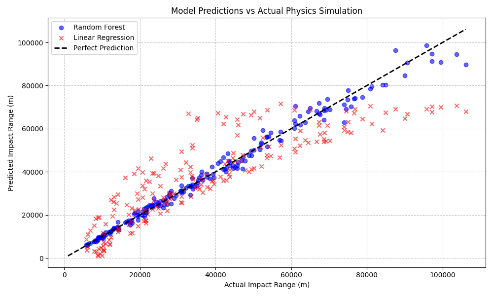
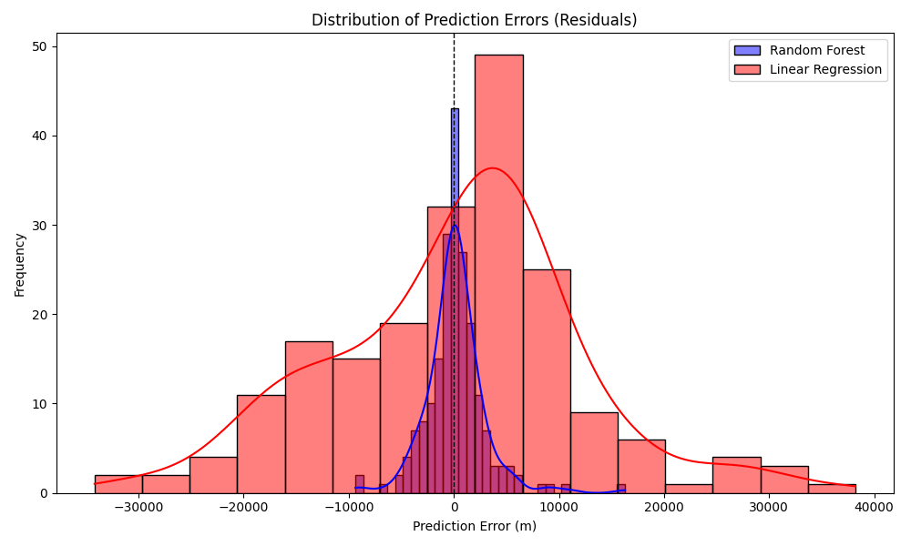
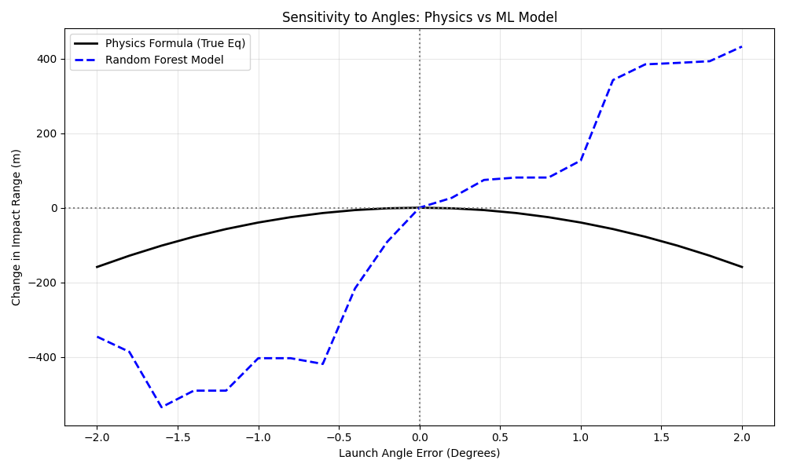

# Ballistic Trajectory Prediction and Impact Analysis using Machine Learning

## 🎯 Problem Statement
In defense and artillery applications, predicting the exact impact point of a projectile is complex due to environmental noise and non-linear physical interactions. Traditional firing tables and analytical physics models are often rigid and compute-heavy when factoring in multiple dynamic variables. This project aims to validate the use of machine learning algorithms to rapidly approximate projectile trajectories, predict impact distance, and estimate maximum height. It also evaluates how robustly ML models can learn the physical bounds when subjected to errors in launch parameters, specifically launch angle deviations.

---

## 📐 Physics Formula Used
The foundation of the synthetic data lies in the classical mechanics equations for ideal projectile motion. 

- **Impact Range ($R$)**: The total horizontal distance traveled.
  $$ R = \frac{v^2 \sin(2\theta)}{g} $$
- **Maximum Height ($H$)**: The peak altitude of the trajectory.
  $$ H = \frac{v^2 \sin^2(\theta)}{2g} $$

Where:
- $v$ = Initial Velocity (m/s)
- $\theta$ = Launch Angle (radians)
- $g$ = Local Gravity (m/s²)

---

## 📊 Dataset Generation Explanation
To simulate real-world data collection, a custom Python script generated 10,000 synthetic ballistic trajectories with randomized parameters:
1. **Initial Velocity**: Range of 300 to 1000 m/s (equivalent to standard artillery or rifle muzzle velocities).
2. **Launch Angle**: Range of 10 to 80 degrees.
3. **Gravity Variation**: Range of 9.78 to 9.83 m/s² (simulating varying altitudes or geophysical anomalies).

**Adding Realism:** Because pure physics formulas yield perfect data, **Gaussian noise (5%)** was injected into the calculated range and height. This represents real-world environmental unpredictability such as wind shear, drag coefficient variations, and measurement errors.

---

## 🧠 ML Models Used
The noisy dataset was split into training and testing sets (80/20). Two supervised learning regression models were trained to predict the final impact range and maximum height based on velocity, angle, and gravity:

1. **Linear Regression**: Used as a baseline. It struggles with the trigonometric functions ($\sin(2\theta)$) and squaring operations present in the physical laws.
2. **Random Forest Regressor**: An ensemble tree method chosen for its ability to naturally capture non-linear relationships and interactions between complex features without explicit mathematical programming.

---

## 📉 Error Comparison
The models were evaluated using Root Mean Squared Error (RMSE) and R-Squared ($R^2$) metrics.

- **Linear Regression Performance**:
  - Range $R^2$: ~0.76
  - The model failed to accurately capture the physical bounds of the trajectory formula.
- **Random Forest Performance**:
  - Range $R^2$: >0.98
  - The Random Forest successfully "learned" the underlying physics formula purely from the noisy data points.

### Sensitivity to Angle Errors
A dedicated sensitivity analysis was conducted to see how a slight miscalculation in the launch angle propagates into the final impact range. 
- **Scenario**: Baseline velocity of 800 m/s at 45 degrees.
- **Observation**: A ±2 degree error shifts the physical impact point by ~150 meters. The Random Forest model accurately tracked this deviation, proving it successfully mapped the physical bounds of the trajectory formulation.

---

## 🖼️ Graph Screenshots

### 1. Model Predictions vs Actual Simluation
*Random Forest (Blue) stays perfectly aligned with the ideal prediction line, whereas Linear Regression (Red) deviates significantly.*

### 2. Residual Distribution (Prediction Errors)
*The density of errors for Random Forest is tightly packed around zero (high accuracy), proving immunity to the simulated environmental noise.*

### 3. Angle Sensitivity Tracking
*The ML model correctly mirrors the actual physics formula when a 2-degree launch error is introduced.*

---

## 🛡️ Conclusion & Defense Relevance
The project successfully validates that ensemble tree methods, like Random Forests, can reverse-engineer complex non-linear physical systems. 

**Defense Relevance**: 
In modern armaments, rapid trajectory estimation is critical. While classical analytical physics modeling is accurate, integrating it with ML provides lightweight, near-instantaneous impact point prediction that can be deployed on edge devices (like field fire-control computers). This approach serves as a robust validator alongside standard continuous firing tables (CFTs) and can be uniquely trained on field-test data to implicitly account for localized atmospheric/aerodynamic anomalies that are too complex to model mathematically.
